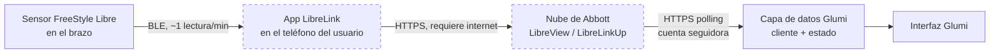
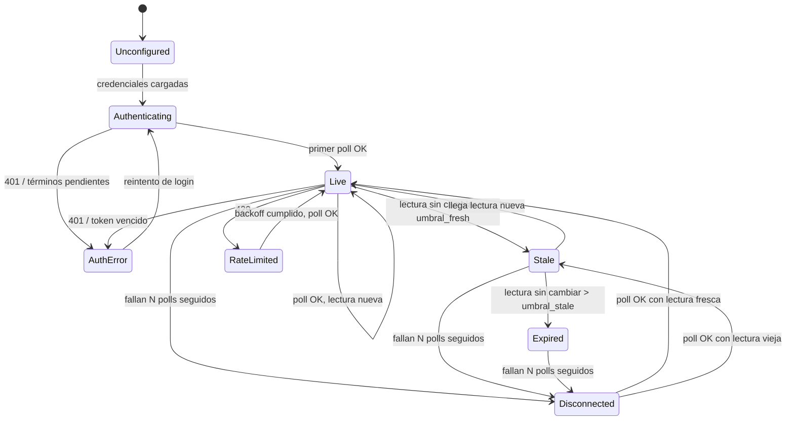

# CGM Data Pipeline — Integration Evaluation and Implementation Plan

Evaluación de las alternativas reales para obtener el dato de glucosa del usuario cero desde FreeStyle Libre, y plan de implementación por fases para llegar a un pipeline confiable **antes** de tocar hardware.

Este es un artefacto intermedio de Layer 3: sirve para decidir, no para ser la fuente de verdad. Lo que sobreviva a la validación de la Fase 0 y la Fase 1 se promueve a `latest/architecture-overview.md`, `latest/tech-stack-rationale.md` y a uno o dos ADRs. Las decisiones que este documento deja explícitamente abiertas están marcadas con ⚠️, siguiendo la convención del resto de la knowledge base.

---

## Objective and Rationale

El milestone que este plan persigue es uno solo y es demostrable: **obtener programáticamente la lectura de glucosa real y actual del usuario cero, y reflejarla de forma confiable en una interfaz que controlamos nosotros.** Nada más. Sin pantalla física, sin enclosure, sin ESP32.

La razón de atacar el software primero no es de comodidad sino de orden de riesgo. El Product Brief nombra cinco supuestos clave; dos de ellos —que LibreLinkUp siga siendo accesible y que la confiabilidad sea alcanzable sobre una API no oficial— se validan enteramente en software y no requieren un solo componente. El resto de los supuestos, en cambio, no se pueden validar sin el objeto en la mesa de luz. Construir el hardware antes de saber si el dato llega de forma sostenida sería invertir el orden: el modo de falla más caro del proyecto no es una pantalla fea, es un objeto impecable que muestra un número viejo creyéndolo actual.

Hay un segundo argumento, más operativo. Strategic Goals define la confiabilidad sin ambigüedad como **condición de existencia**, no como funcionalidad: *"un display ambiental en el que no se puede confiar es peor que no tener display"*. Esa condición se cumple o se incumple en la capa de datos, no en la de presentación. El firmware puede pintar píxeles perfectos sobre un dato equivocado. Entonces la capa de datos es donde vive el riesgo real del producto y es lo que hay que endurecer primero.

Y hay un tercero, específico de un proyecto unipersonal en tiempo discontinuo: el ciclo de iteración en software es de segundos y el de hardware es de días. Todo lo que se pueda aprender en el ciclo corto tiene que aprenderse ahí. Depurar un parsing de timestamps o una expiración de token contra una pantalla ESP32, a través de un cable serie y un reflash, cuesta un orden de magnitud más que hacerlo con un `console.log`.

### Qué cuenta como éxito de esta etapa

El pipeline completo, de punta a punta, con el dato real:

```
FreeStyle Libre → app LibreLink (teléfono) → nube de Abbott → LibreLinkUp API → capa de datos Glumi → interfaz Glumi
```

Y la capacidad de distinguir, sin ambigüedad y en todo momento, entre un dato actual, un dato viejo y ningún dato.

---

## Scope of This Document

**En alcance:** evaluación de fuentes de datos, arquitectura del pipeline de datos, modelo de dominio, plan de fases, criterios de aceptación, riesgos, seguridad y privacidad de credenciales, y las condiciones que habilitan empezar con hardware.

**Fuera de alcance:** selección de hardware, diseño del enclosure, diseño visual de la interfaz final, decisiones comerciales, postura regulatoria. El portal de configuración descrito en el Product Brief tampoco entra acá: es parte del producto, pero se construye contra la capa de datos una vez que ésta exista.

---

## Data Flow

El primer hallazgo de esta evaluación es que el pipeline tiene **un hop más de los que se suelen dibujar**, y ese hop no lo controlamos ni lo vemos.



Los dos nodos punteados son dependencias fuera de nuestro control y son el origen de la mayoría de los estados degradados que la interfaz tiene que saber comunicar:

| Hop | Qué lo puede romper | Qué ve Glumi | Consecuencia de diseño |
| --- | --- | --- | --- |
| Sensor → teléfono | Teléfono fuera de rango BLE, apagado, app cerrada por el SO, sensor en warm-up o terminado | La API responde 200 con una lectura **vieja** | Es el modo de falla más peligroso: no hay error, hay un número desactualizado. La frescura se calcula siempre sobre el timestamp de la lectura, nunca sobre el éxito del request |
| Teléfono → nube | El teléfono sin datos móviles ni Wi-Fi | Igual que arriba: lectura vieja, sin error | Misma mitigación |
| Nube → Glumi | Caída de Abbott, rate limit, token vencido, cambio de API, aceptación de términos pendiente | Error HTTP, 429, 401, o payload con forma distinta | Taxonomía de errores explícita y distinguible en la interfaz |
| Glumi → red doméstica | Wi-Fi caído, router reiniciado, DNS | Timeout / sin respuesta | Estado "sin conexión" separado de "dato viejo" |

La implicancia más importante para el producto: **el teléfono del usuario sigue siendo parte obligatoria del pipeline.** Glumi no reemplaza al teléfono como fuente, lo reemplaza como *pantalla*. Si el teléfono se queda sin batería, Glumi deja de tener dato nuevo. Esto no es una limitación de nuestra implementación sino de la arquitectura de Abbott, la comparte toda la categoría, y es información que el usuario tiene que poder inferir del display sin que se lo expliquen.

---

## Integration Options

Las opciones se evalúan contra los criterios que importan **para este milestone**, en este orden: que devuelva el dato actual en tiempo casi real, que sea accesible desde Argentina, que no dependa de un permiso que no tenemos, que sea portable a firmware después, y que su riesgo de mantenimiento sea asumible por una sola persona.

| # | Opción | Tipo | Latencia del dato | Disponible en AR | Auth | Portable a ESP32 | Fit |
| --- | --- | --- | --- | --- | --- | --- | --- |
| 1 | LibreLinkUp API (directo) | No oficial / reverse-engineered | ~1–5 min | Sí (región `LA`) | Email + password de cuenta seguidora → JWT | Alta | **Alto** |
| 2 | LibreView / API oficial de Abbott | Oficial, por acuerdo | Casi real | No evaluado ⚠️ | OAuth, con contrato | Media | Bajo hoy |
| 3 | Nightscout como hub (con bridge LLU→NS) | Self-hosted / comunidad | ~1–5 min + hop | Sí | API secret / token | Alta | Medio |
| 4 | BLE directo al sensor | Reverse-engineered | Tiempo real | Sí | Ninguna (cripto del sensor) | Baja | Bajo |
| 5 | xDrip+ / Juggluco en el teléfono como servidor local | Comunidad | Tiempo real | Sí | Local | Alta | Medio-bajo |
| 6 | Agregadores comerciales (Validic, Terra, Thryve) | Oficial, de pago | Variable | No evaluado ⚠️ | OAuth + contrato | Media | Bajo |
| 7 | Dexcom (Share no oficial / API oficial) | Ambas | Share: real / Oficial: 1–3 h de retraso | Sí, pero minoritario | — | — | N/A hoy |

### 1. LibreLinkUp API, directo

Es el mecanismo que Abbott ofrece para que un cuidador siga a una persona: el usuario invita a un "seguidor" desde su app LibreLink, y ese seguidor consulta el dato con su propia cuenta. La app LibreLinkUp habla con un backend HTTPS documentado extensamente por la comunidad, y varias librerías maduras lo implementan.

Cómo funciona, en concreto:

- **Login:** `POST {base}/llu/auth/login` con `{ email, password }`. Devuelve un JWT de larga duración y un `accountId`.
- **Regiones:** el backend está regionalizado. Un login contra `https://api.libreview.io` puede responder `data.redirect = true` con `data.region`, y a partir de ahí hay que usar la base regional. Para Argentina la base esperada es **`https://api-la.libreview.io`** (`LA`, Latinoamérica) — a confirmar empíricamente en la Fase 0, es el primer riesgo específico del contexto argentino.
- **Headers obligatorios:** `product: llu.android`, `version: <versión de la app>` (las librerías mantenidas rondan `4.16.0`), `content-type: application/json`, `Authorization: Bearer <JWT>` y `account-id: sha256(accountId)` en hexadecimal. Ese último header se agregó al protocolo después y su ausencia es la causa más común de implementaciones viejas que dejan de funcionar.
- **Lectura actual:** `GET {base}/llu/connections` devuelve la lista de conexiones del seguidor, **con la última medición incluida**. `GET {base}/llu/connections/{patientId}/graph` devuelve además ~12 horas de historia.
- **Forma del dato:** `Value` + `GlucoseUnits`, `ValueInMgPerDl`, `TrendArrow` (enum 1–5), `isHigh` / `isLow`, `Timestamp` y `FactoryTimestamp`.
- **Estados de login no felices:** la respuesta puede traer un `step.type` pidiendo aceptar términos de uso o política de privacidad, o exigir verificación de email. No son errores HTTP: son estados del flujo que hay que tratar como tales.

**A favor:** es la única opción que hoy cumple las cuatro condiciones a la vez —dato actual, accesible desde Argentina, sin permiso previo, y sobre la fuente que el usuario ya tiene—. Es además lo que usa toda la categoría (SugarPixel, SugarHalo, Glowcose y las soluciones DIY), lo que significa que el camino está pisado y que hay implementaciones de referencia en TypeScript, Python y Rust para leer el protocolo. La superficie es chica: tres endpoints.

**En contra:** es reverse-engineered. Sin contrato, sin SLA, sin permiso y sin garantía de estabilidad. Abbott puede cambiar el header de versión, endurecer Cloudflare o cortar el acceso sin aviso. El EULA de LibreLinkUp no fue leído con criterio legal y el riesgo de usarlo con fines comerciales sigue sin evaluar ⚠️ — es una Open Question ya abierta en Layer 0 y este documento no la cierra.

**Rate limiting:** es real y observable. El backend responde `429` con `Retry-After`, y hay reportes de bloqueos de Cloudflare (error 1015) con intervalos de polling de 3 minutos, resueltos al subir a 5. Ese dato es un reporte puntual sobre la región `DE`, no una política publicada: el intervalo sostenible en `LA` es una incógnita a medir, no a suponer.

### 2. LibreView / API oficial de Abbott

Existe y funciona: Abbott integra Libre con Epic y con plataformas clínicas, y hay partners recibiendo 1.440 lecturas diarias por paciente vía la API cloud de LibreView. Pero el acceso requiere una relación comercial directa con Abbott, la aprobación no está garantizada, y la documentación disponible indica soporte limitado a Estados Unidos.

Para un prototipo personal es inviable: no hay a quién pedirle acceso ni con qué entidad firmarlo —Business Overview es explícito en que no hay empresa—. Sigue siendo, sin embargo, **el destino deseable si Glumi se vuelve comercial**, y por eso importa que la arquitectura no se ate a la forma del payload de LibreLinkUp. Vale la pena abrir la conversación con Abbott Argentina en paralelo, sin bloquear nada: es una gestión de meses cuyo resultado no cambia el plan de las próximas semanas.

### 3. Nightscout como hub

Nightscout es un servidor de datos de glucosa self-hosted, con una API REST documentada y estable, que la comunidad DIY mantiene hace años. No se conecta a Libre por sí solo: necesita un puente, y el puente de referencia (`nightscout-librelink-up`) hace exactamente lo mismo que haríamos nosotros —poll a LibreLinkUp— y sube el resultado a Nightscout.

**A favor:** desacopla a Glumi de Abbott detrás de una API que sí es estable y documentada; si LibreLinkUp cambia, se arregla el puente y el dispositivo no se entera. Da historia, y abre la puerta al segmento DIY que Layer 0 identifica como early adopter natural.

**En contra:** para el milestone actual agrega un hop, un servidor que hay que hostear y mantener, y una latencia extra, sin resolver el riesgo de fondo —el puente sigue dependiendo de LibreLinkUp—. Además contradice una decisión de producto ya tomada: el Product Brief pone a Nightscout explícitamente fuera de alcance y define un producto sin backend propio. Introducirlo ahora sería resolver un problema de mantenimiento que todavía no tenemos, a cambio de una dependencia operativa que sí tendríamos.

**Veredicto:** no para el MVP, pero **sí como segundo adaptador de referencia**. Es el candidato natural para probar que la abstracción de fuente de datos funciona, porque su forma de dato es genuinamente distinta a la de LibreLinkUp. Si algún día Abbott corta el acceso, Nightscout + puente es el plan B con el camino más corto.

### 4. BLE directo al sensor

Técnicamente posible —Juggluco y xDrip+ lo hacen— y elimina de un saque el teléfono, la nube y la dependencia de Abbott. Es la arquitectura más elegante que podría tener este producto y la que ningún competidor tiene.

También es la más cara por lejos. El protocolo del sensor está cifrado, el reverse engineering es continuo y se rompe con cada revisión de firmware de Abbott, y —el punto decisivo— en Libre 2 y Libre 3 el sensor se **empareja con un solo receptor**: si Glumi toma el BLE, el teléfono del usuario deja de recibir el dato y con él las alarmas oficiales. Eso viola directamente la promesa del producto de que *"el CGM del fabricante sigue siendo el sistema de alarmas oficial y la referencia terapéutica"*.

Descartado, y no solo para el MVP: es una decisión de producto además de técnica.

### 5. xDrip+ / Juggluco como servidor local en el teléfono

Ambas apps pueden exponer el dato en la red local. Elimina la nube y baja la latencia a casi cero. Pero requiere que el usuario instale y mantenga una app de la comunidad en su teléfono, la mantenga viva contra el administrador de batería de Android, y no funciona en iOS. Convierte a Glumi en un accesorio de una solución DIY, que es exactamente el posicionamiento que Layer 0 descarta.

Descartado para el producto. Tiene un uso instrumental posible: como **fuente de prueba local** para ejercitar la capa de datos sin golpear la API de Abbott durante el desarrollo — y para eso una fuente falsa propia es más simple todavía.

### 6. Agregadores comerciales (Validic, Terra, Thryve)

Resuelven la relación con Abbott a cambio de un contrato y un costo recurrente por usuario. Para un prototipo personal no tiene sentido: costo fijo, contrato, y un tercero más en la cadena. Vale anotarlo como opción real para la etapa comercial, porque convierte un riesgo legal difuso en un costo conocido — y porque un modelo por usuario entra en tensión directa con la postura de Business Overview de no cargar una suscripción obligatoria al usuario.

### 7. Dexcom

No aplica hoy: el usuario cero usa Libre, y en Argentina Dexcom es minoritario. Se anota únicamente porque define cómo debe verse la abstracción. Dos cosas a tener en cuenta cuando llegue el momento: la API **oficial** de Dexcom entrega el dato con 1 hora de retraso en Estados Unidos y 3 horas fuera de Estados Unidos —deliberadamente, para impedir decisiones clínicas en tiempo real—, o sea que es inservible para un display ambiental; la que sirve es Dexcom Share, también no oficial. Y su flecha de tendencia tiene **siete** estados contra los cinco de Libre, lo que condiciona el enum de dominio desde ahora.

---

## Recommendation

**Construir sobre LibreLinkUp, accediendo directo a la API regional `LA` con las credenciales de una cuenta seguidora dedicada, detrás de una abstracción de fuente de datos propia.**

El razonamiento, corto: es la única alternativa que entrega dato actual, desde Argentina, sin depender de un permiso que no tenemos, sobre la fuente que el usuario cero ya usa. Las demás son mejores en algún eje pero fallan en al menos uno que es bloqueante hoy. Es además coherente con decisiones ya tomadas aguas arriba —el Product Brief define LibreLinkUp como fuente única y exclusiva— y este documento no encontró nada que justifique reabrir esa decisión.

Tres decisiones que acompañan a la principal y que no son obvias:

**Cliente HTTP propio, no una librería, a partir de la Fase 1.** En la Fase 0 conviene usar una librería mantenida (`@diakem/libre-link-up-api-client` en TypeScript, `pylibrelinkup` en Python) para llegar a la primera lectura real en una tarde en vez de en dos días. Pero a partir de la Fase 1 el cliente es nuestro, por una razón concreta: **el destino de este código es firmware C++ sobre ESP32**, donde ninguna de esas librerías existe. Si dejamos el protocolo escondido adentro de una dependencia, el día del port tenemos que redescubrirlo. Escribiéndolo nosotros, el port es una transcripción. La superficie es de tres endpoints; el costo de tenerlo propio es bajo y el de no tenerlo se paga entero más adelante. Las librerías siguen siendo valiosas como **documentación ejecutable del protocolo**.

**Polling sobre `/llu/connections`, no sobre `/graph`.** Ambos traen la lectura actual, pero `/graph` arrastra ~12 horas de historia — que con un sensor que reporta cada minuto son cientos de puntos y un payload de decenas de kilobytes. En Node da lo mismo; en un ESP32 con TLS, el heap disponible después del handshake es el recurso escaso y ese payload es un problema real. Elegir hoy el endpoint chico evita descubrirlo el día que el código corra en el dispositivo. `/graph` queda disponible para cuando haya que dibujar un gráfico, que no es ahora.

**Cuenta seguidora dedicada, nunca la cuenta principal.** Las credenciales que Glumi va a guardar son las de un seguidor invitado, no las de la cuenta LibreLink del usuario. Un seguidor solo puede leer. Si el dispositivo se pierde o las credenciales se filtran, lo que se expone es acceso de lectura a la glucosa, no el control de la cuenta del CGM. Esto ya estaba implícito en el Product Brief; acá queda como requisito explícito de seguridad.

---

## Domain Model

Esta es la parte del trabajo que sobrevive a todo lo demás. El cliente HTTP se va a reescribir, la interfaz se va a rehacer y el lenguaje va a cambiar de TypeScript a C++. Lo que no debería cambiar es **el modelo**: qué es una lectura, qué estados puede tener y qué garantiza la capa de datos.

### Contrato

```
GlucoseReading
  valueMgDl          número entero, siempre en mg/dL
  trend              enum TrendDirection
  readingTime        instante UTC en que el sensor produjo la lectura
  isHigh / isLow     flags del origen, no reinterpretados
  sourceId           qué fuente la produjo

TrendDirection
  FALLING_FAST | FALLING | FALLING_SLOW | STABLE | RISING_SLOW | RISING | RISING_FAST | UNKNOWN

ReadingFreshness   (derivado: ahora − readingTime)
  FRESH | STALE | EXPIRED

SourceStatus       (derivado: resultado del último ciclo de poll)
  CONNECTED | DISCONNECTED | AUTH_ERROR | RATE_LIMITED | SOURCE_ERROR

GlucoseSource      (el puerto)
  getLatestReading() → GlucoseReading | SourceError
  describe()         → identidad y capacidades de la fuente
```

Cuatro decisiones de diseño metidas ahí adentro, que vale la pena hacer explícitas:

**mg/dL es la unidad canónica interna.** Argentina usa mg/dL y la API entrega `ValueInMgPerDl` siempre, con `Value` y `GlucoseUnits` variando según la configuración de la cuenta. Consumir siempre el campo en mg/dL elimina una clase entera de bugs. La unidad de *presentación* es una preocupación de la interfaz, no del dominio, y cuando haya que soportar mmol/L se convierte al borde.

**El enum de tendencia es un superconjunto de siete valores, no los cinco de Libre.** Cuesta lo mismo hoy y evita un cambio de contrato el día que entre Dexcom. El mapeo de Libre usa cinco de los siete y deja `FALLING_SLOW` / `RISING_SLOW` sin usar; eso es correcto y no hay que forzarlo.

**Frescura y estado de conexión son ejes independientes.** Una lectura puede ser vieja aunque la conexión esté perfecta (el teléfono se quedó sin batería) y una lectura puede seguir siendo fresca aunque nuestra red se haya caído recién (todavía no pasaron los minutos). Colapsarlos en un solo estado es el error de diseño que produce displays que mienten. Son dos preguntas distintas: *¿qué tan vieja es esta lectura?* y *¿estamos hablando con la fuente?*

**La frescura se calcula sobre el timestamp de la lectura, nunca sobre el del request.** Un `200 OK` no significa dato nuevo. La API devuelve `FactoryTimestamp` (UTC) y `Timestamp` (hora local del teléfono del usuario), ambos sin offset de zona horaria en el string. Hay que usar `FactoryTimestamp` y verificarlo explícitamente en la Fase 0 ⚠️ — una confusión acá produce un error de horas en el cálculo de antigüedad, del lado peligroso, y es el tipo de bug que en un display ambiental nadie nota hasta que importa.

### Mapeo LibreLinkUp → dominio

| Campo API | Campo dominio | Notas |
| --- | --- | --- |
| `ValueInMgPerDl` | `valueMgDl` | Usar siempre este, ignorar `Value` / `GlucoseUnits` |
| `TrendArrow` 1..5 | `trend` | 1→FALLING_FAST, 2→FALLING, 3→STABLE, 4→RISING, 5→RISING_FAST. Ausente o fuera de rango → UNKNOWN, nunca STABLE |
| `FactoryTimestamp` | `readingTime` | UTC. Parsing explícito, sin depender del locale del runtime |
| `Timestamp` | — | Hora local del teléfono. No usar para frescura; útil solo para diagnóstico |
| `isHigh` / `isLow` | `isHigh` / `isLow` | Se pasan tal cual. Glumi no calcula rangos clínicos |
| `MeasurementColor` | — | Descartado. El color es decisión de nuestra interfaz, no de Abbott |

### Máquina de estados



Umbrales propuestos como punto de partida, todos configurables y todos a ajustar con datos reales de la Fase 1 ⚠️:

| Umbral | Valor inicial | De dónde sale |
| --- | --- | --- |
| `FRESH` | ≤ 6 min | La propia app LibreLinkUp marca "sin datos recientes" a los 5 min; 6 da un margen de un ciclo |
| `STALE` | 6 – 20 min | Suficiente para cubrir un teléfono momentáneamente fuera de rango sin gritar |
| `EXPIRED` | > 20 min | Acá el número deja de ser información y pasa a ser ruido |
| `DISCONNECTED` | 2 ciclos de poll fallidos | Un fallo aislado no es una caída |
| Intervalo de poll | 60 s inicial, adaptativo | A medir contra los límites reales de la región `LA` |

Sobre el polling, una nota de diseño: **poll adaptativo, no timer fijo.** El sensor produce una lectura por minuto, y una vez conocido el `readingTime` de la última, el siguiente dato es predecible. Programar el próximo request para poco después del minuto esperado, con jitter, da la misma frescura con menos requests que un timer ciego — y menos requests es exactamente lo que baja el riesgo de rate limit. Ante `429`, respetar `Retry-After`; ante fallos repetidos, backoff exponencial con techo.

---

## Implementation Plan

Cuatro fases. Las tres primeras son las que propuso el brief de la tarea, con dos modificaciones que se argumentan abajo; la cuarta es un agregado.

**Primera modificación:** la fuente falsa (`FakeGlucoseSource`) se adelanta de la Fase 2 a la Fase 1. Los estados degradados —dato viejo, sin datos, sin conexión, error de auth— no se pueden reproducir a demanda contra la API real: hay que esperar a que ocurran, o desenchufar el router y apagar el teléfono. Sin una fuente falsa guionable, la Fase 2 se vuelve una sesión de testing manual poco confiable, y esos estados degradados son justamente donde vive la promesa del producto. La fuente falsa no es andamiaje de testing: es el instrumento que hace verificable la condición de existencia del producto.

**Segunda modificación:** se agrega una Fase 3 de soak test. Que el pipeline funcione una tarde no dice nada sobre si funciona una semana. Los modos de falla que importan —expiración de token, rotación de sensor, caída nocturna de Wi-Fi, drift de reloj, fuga de memoria— solo aparecen con el tiempo corriendo. Y es la fase que efectivamente habilita el hardware.

### Fase 0 — Validar el acceso al dato

**Objetivo:** probar que podemos obtener programáticamente la lectura real y actual del usuario cero. Nada más.

**Tiempo estimado:** 1 sesión. Si lleva más de dos, hay un hallazgo que reportar (probablemente regional) y es información valiosa por sí misma.

Alcance: crear la cuenta seguidora dedicada e invitarla desde la app LibreLink; autenticar contra la API; identificar la región real que devuelve el login para una cuenta argentina; obtener la última lectura; imprimirla en consola.

**Entregables**

- Script mínimo, ~50 líneas, apoyado en una librería de la comunidad. Sin abstracciones, sin arquitectura.
- Salida en consola con el formato del brief:
  ```
  Glucosa: 112 mg/dL
  Tendencia: →
  Última lectura: 15:34
  ```
- Un volcado crudo (JSON completo, headers de respuesta, código HTTP) de `/llu/auth/login`, `/llu/connections` y `/llu/connections/{id}/graph`, guardado como **fixture**. Este archivo es el entregable más importante de la fase: es lo que hace que el cliente propio de la Fase 1 y el port a C++ más adelante sean transcripciones y no investigaciones.
- Nota corta con los hallazgos: región devuelta, versión de `product`/`version` que funcionó, forma exacta de los timestamps, si hizo falta aceptar términos.

**Criterios de aceptación**

- [ ] El valor impreso coincide con el que muestra la app LibreLink del teléfono, con menos de 5 minutos de diferencia.
- [ ] La región del endpoint que funciona para una cuenta argentina está confirmada y anotada.
- [ ] El script corre dos veces seguidas con más de un minuto de diferencia y en la segunda devuelve un `readingTime` distinto — esto prueba que el dato es *actual* y no una lectura cacheada.
- [ ] Está registrado qué campo de timestamp es UTC, verificado contra la hora real de la lectura en el teléfono.
- [ ] Ninguna credencial quedó escrita en el código.

**Riesgo de la fase:** que la región `LA` se comporte distinto de lo documentado por la comunidad, que está mayormente centrada en Europa y Estados Unidos. Si así fuera, es un hallazgo temprano y barato — exactamente para eso existe esta fase.

### Fase 1 — Capa de datos confiable

**Objetivo:** convertir un script que funciona en una capa de datos en la que se puede confiar, con estados explícitos.

Alcance: modelo de dominio y puerto `GlucoseSource`; adaptador propio de LibreLinkUp reemplazando a la librería; gestión de sesión (persistencia del token, re-login automático al vencer); taxonomía de errores; máquina de estados de frescura y conexión; poll adaptativo con backoff; `FakeGlucoseSource` guionable; logging estructurado.

**Entregables**

- Paquete `core` con el dominio y el puerto, sin ninguna dependencia de LibreLinkUp.
- Paquete `source-librelinkup` con el adaptador propio, construido sobre los fixtures de la Fase 0.
- `FakeGlucoseSource` capaz de reproducir a demanda: valor estable, subida rápida, bajada rápida, dato que envejece hasta `STALE` y `EXPIRED`, ausencia total de dato, error de red y error de autenticación.
- Tests de la máquina de estados contra la fuente falsa, y del mapeo API→dominio contra los fixtures.
- Un `GlucoseState` observable que expone en todo momento: valor, unidad, tendencia, `readingTime`, antigüedad en segundos, `ReadingFreshness` y `SourceStatus`.
- **Documento de contrato de la API** promovible a `latest/` — endpoints, headers, códigos, forma del payload, comportamiento de errores. Es el artefacto que sobrevive al cambio de lenguaje.

**Criterios de aceptación**

- [ ] La interfaz de la capa de datos no menciona LibreLinkUp en ningún tipo, nombre ni comentario. Sustituir `LibreLinkUpSource` por `FakeGlucoseSource` no requiere tocar nada aguas arriba.
- [ ] Los siete estados se pueden reproducir a demanda desde la fuente falsa, de forma determinística.
- [ ] La capa **nunca** reporta `FRESH` con una lectura más vieja que el umbral. Verificado con un test que avanza el reloj.
- [ ] Un `200 OK` con la misma lectura de hace 15 minutos produce `STALE`, no `CONNECTED` a secas.
- [ ] Un token vencido dispara re-login automático sin intervención, y si el re-login falla el estado es `AUTH_ERROR` y no `DISCONNECTED`.
- [ ] Un `429` produce backoff respetando `Retry-After`, y no un reintento inmediato.
- [ ] Desenchufar el router produce `DISCONNECTED` dentro de los 2 ciclos, y volver a enchufarlo produce recuperación sin reiniciar el proceso.
- [ ] Las credenciales viven fuera del código y no aparecen jamás en los logs.

### Fase 2 — Interfaz mínima de Glumi

**Objetivo:** validar la experiencia fundamental —glucosa actual y tendencia, visibles de un vistazo— y que los estados del sistema se comunican sin ambigüedad.

Alcance: una página web servida localmente que consume el `GlucoseState` de la Fase 1. Sin build tooling elaborado, sin framework de componentes, sin diseño visual. Número grande, flecha, hora y estado.

Una decisión que vale la pena tomar acá y no después: **la interfaz se desarrolla dentro de un marco con las proporciones y la resolución del display candidato**, aunque el hardware todavía no esté elegido. No cuesta nada y convierte a la Fase 2 en un simulador de display en vez de en una página web que después hay que rehacer desde cero. Si el display candidato cambia, cambia un número en el CSS. Esto no es decidir hardware: es no tomar decisiones de layout que asuman una pantalla de escritorio.

**Entregables**

- Interfaz mínima mostrando valor, unidad, flecha de tendencia, hora de la última lectura y antigüedad.
- Tratamiento visual explícito y distinguible de los siete estados.
- Un modo demo que corre contra la fuente falsa y permite recorrer todos los estados sin depender de la API real ni de la glucosa del usuario cero.
- Una decisión escrita por cada estado sobre **qué se muestra y qué se oculta**.

La pregunta de diseño de esta fase no es cómo se ve el número. Es qué pasa con el número cuando el dato deja de ser confiable:

| Estado | Qué mostrar | Razonamiento |
| --- | --- | --- |
| Normal | Valor + flecha + hora | El caso feliz |
| Subiendo / bajando | Igual, con la flecha haciendo el trabajo | La tendencia es tan importante como el valor |
| Desactualizado | Valor visiblemente atenuado + antigüedad explícita | El dato todavía informa, pero no puede parecer actual |
| Sin datos | **Sin valor.** Última hora conocida | Un número de hace 40 minutos no es información, es una trampa |
| Sin conexión | Sin valor + causa | Distinto de "sin datos": el problema es nuestro, no del teléfono |
| Error de auth | Sin valor + acción requerida | Es el único estado que el usuario puede resolver, y el display tiene que decírselo |

El principio que ordena la tabla: **ante la duda, esconder el número.** Un display en blanco es honesto; un número viejo que parece actual es el único modo de falla que el producto declaró inaceptable.

**Criterios de aceptación**

- [ ] El valor y la tendencia se leen a 3 metros. Verificado a ojo, sin instrumentos.
- [ ] Los siete estados se pueden recorrer en modo demo y cada uno es distinguible de los otros seis sin leer texto explicativo.
- [ ] En ningún estado degradado se muestra un número que pueda confundirse con una lectura actual.
- [ ] Desenchufar el router mientras la interfaz está abierta produce el estado correcto en menos de 2 ciclos de poll, y reconecta solo.
- [ ] La interfaz no importa nada de `source-librelinkup`.

### Fase 3 — Soak test y endurecimiento

**Objetivo:** demostrar que el pipeline no solo funciona, sino que **sigue funcionando**. Es la fase que habilita el hardware.

Alcance: dejar el sistema corriendo de forma continua contra la API real durante al menos 7 días, registrando cada ciclo de poll, y revisar el registro.

**Entregables**

- Log estructurado de todos los ciclos: timestamp, resultado, estado, latencia.
- Reporte de soak: uptime, distribución de estados, cantidad y causa de fallos, frecuencia de re-login, incidencias de rate limit, latencia p50/p95, huella de memoria a lo largo del tiempo.
- Registro de los eventos del mundo real que ocurrieron: cambio de sensor, noches con el teléfono lejos, cortes de Wi-Fi.
- Lista de los ajustes de umbrales que los datos reales justifiquen.
- Fixtures de las respuestas anómalas que aparezcan — son las más valiosas y las imposibles de conseguir a demanda.

**Criterios de aceptación**

- [ ] 7 días continuos sin intervención manual.
- [ ] Cero eventos en los que el sistema reportó `FRESH` sobre una lectura fuera del umbral. **Este criterio es binario: un solo evento invalida la fase.**
- [ ] Al menos un ciclo de expiración y re-login de token, recuperado solo.
- [ ] Al menos un cambio de sensor atravesado, con el comportamiento durante el warm-up documentado.
- [ ] Al menos un corte de red real, recuperado solo.
- [ ] El intervalo de poll sostenible sin `429` en la región `LA` está medido, no supuesto.
- [ ] Sin crecimiento de memoria atribuible a fugas.

---

## Technical Risks, Dependencies and Unknowns

| # | Riesgo / Incógnita | Prob. | Impacto | Cuándo se resuelve | Mitigación |
| --- | --- | --- | --- | --- | --- |
| 1 | La región `LA` se comporta distinto de lo documentado por la comunidad | Media | Alto | Fase 0 | Es lo primero que se valida. Si falla, el proyecto se entera el día uno |
| 2 | Abbott cambia el protocolo o endurece Cloudflare | Media | Crítico | Continuo | Cliente propio y aislado detrás del puerto; fixtures que permiten detectar el cambio rápido; Nightscout + puente como plan B documentado |
| 3 | Rate limiting más agresivo de lo esperado en `LA` | Media | Medio | Fase 1–3 | Poll adaptativo, jitter, backoff respetando `Retry-After`. Medir, no suponer |
| 4 | El usuario cero usa Libre 2 y no Libre 3 ⚠️ | — | Medio | Fase 0 | Cambia la cadencia real del dato y por lo tanto los umbrales. **Es un dato que hay que confirmar antes de fijar umbrales** |
| 5 | Confusión entre `FactoryTimestamp` (UTC) y `Timestamp` (local) | Alta si no se atiende | Alto | Fase 0 | Verificación explícita como criterio de aceptación. Bug silencioso, del lado peligroso |
| 6 | Deriva del reloj del sistema | Baja ahora, **alta en ESP32** | Alto | Fase 3 / hardware | La frescura depende de un reloj confiable. NTP obligatorio en firmware; anotar ya como requisito |
| 7 | El EULA de LibreLinkUp prohíbe el acceso automatizado | Media | Crítico para comercializar | Sin resolver ⚠️ | Ya es Open Question de Layer 0. No bloquea el uso personal; sí bloquea la venta |
| 8 | El token vence de forma inesperada o requiere re-aceptar términos | Media | Medio | Fase 1–3 | `AUTH_ERROR` como estado de primera clase, con instrucción al usuario |
| 9 | El payload de `/graph` no entra cómodo en el heap del ESP32 | Media | Medio | Al portar | Ya mitigado: se usa `/llu/connections` desde el principio |
| 10 | Dependencia del teléfono del usuario, invisible y no controlable | Alta (es estructural) | Medio | Diseño | No se elimina, se comunica: los estados degradados existen para eso |
| 11 | La librería de la comunidad usada en Fase 0 queda desactualizada | Alta | Bajo | Fase 1 | Es deliberadamente descartable. Su valor es el fixture que produce |

**Dependencias externas que no controlamos:** nube de Abbott, app LibreLink en el teléfono del usuario, conectividad del teléfono, red doméstica, y la política de Abbott respecto del acceso no oficial. Es la misma exposición que tiene toda la categoría, según lo ya documentado en Competitive Landscape.

---

## Security and Privacy

El sistema maneja dos cosas sensibles: credenciales de una cuenta que da acceso a datos de salud, y los datos de glucosa en sí, que en Argentina son datos personales sensibles bajo la Ley 25.326 ⚠️ (la implicancia regulatoria exacta para un producto comercial no fue evaluada y es materia de Layer 0).

**A favor del diseño actual:** la arquitectura elegida es la más privada posible dentro de las opciones viables. Sin backend, sin cuenta de usuario y sin telemetría, **el dato de glucosa nunca toca un servidor nuestro**. Va de Abbott al dispositivo del usuario y ahí muere. No hay base de datos que filtrar porque no hay base de datos. Esa propiedad vale más que cualquier control que pudiéramos agregar después, y conviene entenderla como una decisión de producto —no solo técnica— que no habría que revertir sin muy buenas razones.

**Reglas para estas fases:**

1. **Cuenta seguidora dedicada, nunca la cuenta principal.** Acceso de solo lectura, revocable desde la app del usuario sin tocar nada más.
2. **Credenciales fuera del código y fuera del repositorio.** Variables de entorno o un archivo local ignorado por git. Ningún commit con credenciales, ni siquiera en un repo privado — el usuario cero es el fundador y el repo es su historia pública futura.
3. **Nunca loguear credenciales ni tokens.** Ni en debug. El logging estructurado de la Fase 1 se diseña con esto adentro, no se arregla después.
4. **Los logs de glucosa del soak test son datos de salud.** Quedan locales, fuera del repositorio, y se borran cuando dejan de ser útiles.
5. **Prohibida cualquier telemetría hacia afuera.** Si algún día hace falta diagnóstico remoto, es una decisión de producto explícita, no un detalle de implementación.

**Lo que hay que resolver recién en la etapa de firmware, y conviene anotar ahora:** las credenciales van a vivir en el flash del ESP32, donde son legibles por cualquiera con acceso físico y un cable. Mitigaciones disponibles —cifrado de flash, almacenamiento en NVS con clave derivada del eFuse— tienen costo de complejidad. Para una unidad personal es aceptable tal cual; para un lote en manos de terceros es una decisión pendiente ⚠️. El daño acotado que produce una fuga de credenciales de seguidor —lectura de glucosa, revocable— es parte de por qué la decisión de la cuenta dedicada importa más de lo que parece.

---

## Architectural Decisions: Now vs. Deferred

### Decidir ahora

| Decisión | Postura | Por qué ahora |
| --- | --- | --- |
| Fuente de datos del MVP | LibreLinkUp directo, región `LA` | Bloquea todo lo demás |
| Cuenta seguidora dedicada | Sí, obligatorio | Cambiarlo después implica rehacer el flujo de configuración |
| Abstracción `GlucoseSource` | Sí, un puerto y dos adaptadores (real + falso) | Cuesta poco hoy; retrofitear una abstracción sobre código acoplado cuesta mucho |
| Unidad canónica interna | mg/dL siempre | Una clase entera de bugs, eliminada de entrada |
| Enum de tendencia | Superconjunto de 7 valores | Cambiar un enum de dominio después toca todas las capas |
| Frescura y conexión como ejes separados | Sí | Es la promesa central del producto; colapsarlos es el error de diseño a evitar |
| Frescura calculada sobre `readingTime` UTC | Sí | Bug silencioso y peligroso si se decide mal |
| Endpoint de polling | `/llu/connections` | Condicionado por el heap del ESP32; elegirlo tarde obliga a rehacer el cliente |
| Cliente HTTP propio desde Fase 1 | Sí | El protocolo tiene que ser nuestro para poder portarlo a C++ |
| Sin backend, sin telemetría | Sí | Es una decisión de privacidad además de una de alcance |
| Fuente falsa guionable | Sí, desde Fase 1 | Es el único instrumento que hace verificables los estados degradados |

### Postergar deliberadamente

| Decisión | Por qué esperar | Cuándo se decide |
| --- | --- | --- |
| Lenguaje y stack del firmware | No cambia nada de las Fases 0–3 y depende del hardware | Al elegir hardware |
| Modelo de hardware y display | Fuera de alcance por diseño; la Fase 2 solo asume proporciones | Después de la Fase 3 |
| Persistencia e historia de lecturas | El MVP muestra el presente, no el pasado. Un buffer circular en RAM alcanza | Si aparece un gráfico |
| Soporte de Dexcom / Nightscout | Sin usuario que lo pida. El puerto mantiene la puerta abierta | Cuando haya demanda real |
| Portal de configuración web | Se construye contra la capa de datos, que todavía no existe | Después de la Fase 1 |
| Umbrales definitivos de frescura | Suponerlos es inventar; medirlos es barato | Fase 3, con datos reales |
| mmol/L y multi-idioma | El usuario cero usa mg/dL y español | Antes del lote externo |
| Arquitectura comercial (backend, cuentas, fleet) | Cambiaría la postura legal frente a Abbott y la de privacidad. Ver abajo | Si el proyecto se vuelve comercial |
| Cifrado de credenciales en flash | Depende del hardware y del modelo de amenaza del lote | Antes de la unidad número dos |

### La decisión que más condiciona el futuro

Vale aislarla porque no es obvia y no es reversible barata: **quién hace el polling a Abbott.**

Hoy, cada dispositivo consulta con las credenciales del propio usuario. Eso es, funcionalmente, un cliente de LibreLinkUp más — la misma postura que tienen las soluciones DIY y, hasta donde se puede observar, la de los competidores de la categoría. El día que Glumi tenga un backend que consulte a Abbott en nombre de sus usuarios, la postura cambia de naturaleza: pasa de "cada usuario accede a su propio dato" a "una empresa accede sistemáticamente a datos de terceros desde una infraestructura centralizada, con fines comerciales". Es más visible, más fácil de bloquear con una regla de Cloudflare, y expone bastante más.

No hay que resolverlo hoy. Pero la arquitectura sin backend del MVP **no es solo una simplificación**: es también la postura menos expuesta, y conviene salir de ella a propósito y no por acumulación de features.

---

## Supporting Other CGMs Later

La pregunta es cómo no bloquear Dexcom y Nightscout sin construirlos ahora. La respuesta corta: con el puerto `GlucoseSource` y nada más.

Lo que el puerto ya resuelve: la interfaz pide un `GlucoseReading` y no sabe de dónde viene. Agregar una fuente es escribir un adaptador que traduzca a ese modelo. El enum de tendencia ya contempla los siete estados de Dexcom. La unidad canónica ya está fijada. El modelo no expone ningún concepto propio de Abbott.

Lo que **no** hay que construir todavía, y es donde está la tentación de sobre-ingeniería:

- Un registro de fuentes con descubrimiento dinámico. Un `switch` sobre un string de configuración alcanza y sobra para dos fuentes.
- Una capa de configuración genérica por fuente. Cada fuente tiene credenciales distintas; un esquema genérico hoy es abstracción sin ejemplos.
- Selección automática o failover entre fuentes. El producto es un dispositivo, una persona, una fuente.
- Normalización de historia y agregaciones. El MVP muestra el presente.
- Una capa de plugins. Es una sola persona escribiendo el código.

La prueba de que la abstracción funciona no es agregar Dexcom: es que `FakeGlucoseSource` —que ya se construye en la Fase 1 por otras razones— sea sustituible sin tocar nada aguas arriba. Si la interfaz funciona igual contra la fuente falsa y contra la real, la abstracción es suficiente. Si no funciona, ninguna cantidad de generalidad la va a arreglar.

Cuando llegue el momento, el orden probable es Nightscout primero —porque es el plan B ante un corte de Abbott y porque su forma de dato es genuinamente distinta, que es lo que ejercita de verdad la abstracción— y Dexcom después, solo si aparece un usuario que lo pida.

---

## Exit Criteria: When to Start Touching Hardware

La base de software se considera suficientemente validada cuando **todas** estas condiciones se cumplen a la vez. No es una lista de deseos: es la definición de "listo" para esta etapa.

**Del dato**

- [ ] Fase 3 completa: 7 días continuos de operación sin intervención.
- [ ] Cero eventos de dato presentado como fresco estando fuera del umbral.
- [ ] Expiración y renovación de token atravesada y recuperada sola.
- [ ] Al menos un cambio de sensor y un corte de red real atravesados, con comportamiento documentado.
- [ ] Intervalo de poll sostenible en la región `LA` medido empíricamente.

**Del software**

- [ ] Los siete estados reproducibles a demanda y distinguibles en la interfaz.
- [ ] La interfaz no conoce LibreLinkUp: la sustitución por la fuente falsa no requiere cambios aguas arriba.
- [ ] Contrato de la API documentado con el detalle necesario para reimplementarlo en otro lenguaje sin volver a investigar.
- [ ] Fixtures de respuestas reales, incluidas las anómalas, guardados y versionados.
- [ ] Credenciales externalizadas; nada sensible en el repositorio ni en los logs.

**Del conocimiento**

- [ ] Umbrales de frescura ajustados con datos reales, no supuestos.
- [ ] Tamaño de payload y latencia p95 medidos — son insumos directos del dimensionamiento del ESP32.
- [ ] Requisito de reloj confiable (NTP) anotado como requisito de firmware.
- [ ] Este documento promovido a `latest/`: Architecture Overview actualizado y al menos un ADR sobre la elección de fuente de datos.

**Y una condición de juicio, que no es un checkbox:** que el usuario cero haya mirado la interfaz en vez del teléfono, al menos una vez, sin proponérselo. No prueba la tesis del producto —eso requiere el objeto físico y meses de uso—, pero si ni siquiera en una pantalla abierta al lado del teclado el dato resulta más cómodo que el teléfono, eso es información temprana y barata sobre la tesis central, y conviene tenerla antes de imprimir un enclosure.

---

## Open Questions

| Pregunta | Por qué importa | Se resuelve en |
| --- | --- | --- |
| ¿Qué sensor usa hoy el usuario cero: Libre 2, Libre 3 o Libre 3 Plus? ⚠️ | Determina la cadencia real del dato y por lo tanto los umbrales de frescura | Antes de la Fase 0 — es una pregunta, no una investigación |
| ¿Cuál es la región real que devuelve el login para una cuenta argentina? | Toda la configuración del cliente depende de esto | Fase 0 |
| ¿Cuál es el intervalo de poll sostenible en `LA` sin disparar rate limiting? | Condiciona la frescura máxima alcanzable | Fase 3 |
| ¿Qué dice exactamente el EULA de LibreLinkUp sobre el acceso automatizado? ⚠️ | No bloquea el uso personal; sí la comercialización | Layer 0, sin fecha |
| ¿Tiene sentido iniciar la conversación con Abbott Argentina por acceso oficial? | Gestión de meses que no bloquea nada, pero que tarde o temprano hay que empezar | Layer 0 |
| ¿Se versiona el prototipo en un repo público o privado? | Datos de salud en logs y credenciales en configuración | Antes de la Fase 1 |
| ¿El proyecto se llama Glumi de forma definitiva? ⚠️ | Business Overview dice que la marca no tiene nombre definido; el código va a heredar el que se use | Layer 0 |

---

## References

**Implementaciones de referencia del protocolo**

- [PyLibreLinkUp](https://pylibrelinkup.readthedocs.io/en/stable/) — cliente Python, la referencia más clara de headers, regiones, manejo de `429` y flujo de términos de uso.
- [robberwick/pylibrelinkup](https://github.com/robberwick/pylibrelinkup) — repositorio del anterior.
- [@diakem/libre-link-up-api-client](https://www.npmjs.com/package/@diakem/libre-link-up-api-client) — cliente TypeScript con manejo de sesión; candidato para la Fase 0.
- [DRFR0ST/libre-link-unofficial-api](https://github.com/DRFR0ST/libre-link-unofficial-api) — otra implementación TypeScript.
- [timoschlueter/nightscout-librelink-up](https://github.com/timoschlueter/nightscout-librelink-up) — puente LibreLinkUp → Nightscout. Referencia del plan B y de las prácticas de polling.
- [Cloudflare RateLimit — issue #182](https://github.com/timoschlueter/nightscout-librelink-up/issues/182) — reporte de rate limiting con polling de 3 min, resuelto a 5 min.
- [HTTP dump de LibreLinkUp con Libre 3](https://gist.github.com/khskekec/6c13ba01b10d3018d816706a32ae8ab2) — volcado crudo del protocolo.
- [FokkeZB/libreview-unofficial](https://github.com/FokkeZB/libreview-unofficial) — documentación del API de LibreView.

**Abbott**

- [LibreLinkUp FAQ](https://www.librelinkup.com/faqs) — comportamiento oficial del seguidor, incluido el umbral de 5 minutos para "sin datos recientes".
- [LibreLinkUp EULA](https://api.libreview.io/document/toullu?lang=en) — términos, pendientes de lectura con criterio legal ⚠️.
- [Abbott Partner Integrations](https://www.diabetescare.abbott/partnerships/integrations/en.html) — camino oficial.
- [Abbott API Integration for Developers (Validic)](https://help.validic.com/space/VCS/4287823892/Abbott+API+Integration+for+Developers) — condiciones de acceso a la API oficial.

**Dexcom, para la abstracción futura**

- [Dexcom API v3 — endpoint overview](https://developer.dexcom.com/docs/dexcomv3/endpoint-overview/) — incluye el retraso de 1 h (US) y 3 h (fuera de US).
- [gagebenne/pydexcom](https://github.com/gagebenne/pydexcom) — cliente de Dexcom Share, la vía de tiempo real.

**Documentos internos**

- [Product Brief](../../layer-1-product/latest/product-brief.md)
- [Strategic Goals and Constraints](../../layer-0-business/latest/strategic-goals-and-constraints.md)
- [Business Overview](../../layer-0-business/latest/business-overview.md)
- [Competitive Landscape](../../layer-0-business/latest/competitive-landscape.md)
