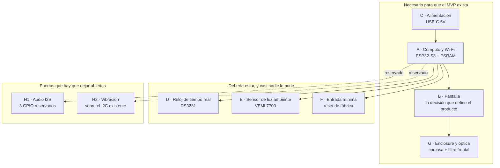

# Hardware — Desglose de Componentes y Opciones de Abastecimiento

Qué piezas hay que comprar para que Glumi exista como objeto, qué opciones reales hay para cada una, y cuáles de esas opciones se consiguen desde Buenos Aires.

Este es un artefacto intermedio de Layer 3. Sirve para decidir y para comprar, no para ser fuente de verdad. El documento hermano —[CGM Data Pipeline](cgm-data-pipeline-integration-plan.md)— dejó la selección de hardware explícitamente fuera de alcance y puso el hardware detrás de los criterios de salida de la Fase 3. Esto no adelanta esa decisión: la prepara, para que el día que la Fase 3 cierre no empiece ahí una investigación de tres semanas y un pedido de seis. Las decisiones abiertas van marcadas con ⚠️, como en el resto de la knowledge base.

---

## Los dos hallazgos que reordenan todo

Antes del desglose, porque cambian el orden de las prioridades y porque ninguno de los dos es obvio desde la mesa de trabajo.

**Primero: el canvas de diseño ya eligió la tecnología de pantalla, aunque no lo dijera.** Las tres direcciones exploradas en `glumi-mvp/design/` son oscuras, y la anotación del canvas dice por qué: *"Un fondo claro cumple a 3 metros de día y falla de noche: ilumina el cuarto, que es exactamente lo que el brief pide evitar."* Ese razonamiento es correcto y tiene una consecuencia que el canvas no sacó: **un IPS retroiluminado no tiene fondo negro, tiene fondo gris tenue encendido.** En un cuarto a oscuras, un panel LCD mostrando `#0a0b0d` no es invisible — es un rectángulo que brilla débilmente, con el marco del panel visible. El negro del mockup solo existe de verdad en tecnologías emisivas por píxel: AMOLED, OLED monocromo, matriz de LEDs, VFD. El diseño ya tomó la decisión de hardware; falta hacerla explícita.

**Segundo: el número del mockup es demasiado chico para la promesa del producto.** El brief pide legibilidad *"desde el otro lado de la habitación"*, que para un dormitorio o un escritorio son ~3 metros. La regla de señalética es ~25 mm de altura de glifo por cada 3 m de distancia para lectura cómoda de un vistazo. El mockup usa `font-size: 116px` sobre un lienzo de 240 px de alto; la tinta real de un dígito es ~0,72 em, o sea ~83 px, o sea **35% de la altura del panel**. Sobre un 2.8" eso son 14,8 mm y sobre un 3.2" son 16,9 mm. Se lee a 3 m, pero forzando — y forzar la lectura es exactamente el gesto que el producto existe para eliminar.

De los dos hallazgos sale la tensión que gobierna toda la compra: **negro real y tamaño físico no se consiguen juntos a este presupuesto.** No existe hoy un AMOLED grande y barato. Todo lo que sigue es cómo resolver esa tensión.

---

## Alcance

**En alcance:** desglose funcional de subsistemas, criterios de selección por subsistema, opciones concretas con precios, disponibilidad en Argentina, aritmética real del costo de importar, lista de compras ejecutable y presupuesto.

**Fuera de alcance:** diseño industrial y del enclosure (Layer 2), lenguaje y arquitectura del firmware (se decide con el hardware elegido, no antes), certificación ANMAT y manufactura en volumen (Layer 0), y la decisión final de pantalla — que este documento deliberadamente **no cierra**, y explica por qué.

---

## El objeto, desglosado



| # | Subsistema | ¿Obligatorio en el MVP? | Por qué existe |
| --- | --- | --- | --- |
| A | Cómputo + Wi-Fi | Sí | Corre el cliente de LibreLinkUp, el TLS, la máquina de estados, el portal de configuración y el dibujo del display |
| B | Pantalla | Sí | Es el producto. Todo lo demás es soporte |
| C | Alimentación USB-C | Sí | El brief la fija: alimentación continua, sin batería |
| D | Reloj de tiempo real | **Debería** | La frescura se calcula contra el reloj local. Es el riesgo #6 del plan de datos, y el único componente de USD 3 que protege la promesa central del producto |
| E | Sensor de luz ambiente | **Debería** | El modo nocturno del brief. Sin sensor es un horario fijo, que falla cada vez que el usuario se acuesta a otra hora |
| F | Entrada mínima | Sí | Reset de fábrica: sin él, un cambio de router deja el dispositivo muerto — la falla más documentada de los competidores |
| G | Enclosure + óptica | Sí | Sin carcasa no hay objeto sobre la mesa de luz, y sin objeto no se valida la tesis central |
| H | Audio + vibración | **No**, pero condiciona | El brief es explícito: *"el hardware del MVP debe dejar lugar a salida de audio y vibración en lugar de cerrar esa puerta"* |

---

## B · Pantalla — la decisión que define el producto

### Criterios, en orden de peso

1. **Altura de glifo ≥ 25 mm** con un layout realista (número ocupando ~60% del alto útil, dejando lugar para flecha, unidad y hora). Es la traducción física de *"legible desde el otro lado de la habitación"*.
2. **Negro real en oscuridad total.** El objeto vive en una mesa de luz. Si el panel apagado brilla, el producto incumple su propuesta antes de mostrar un número.
3. **Rango de atenuación hasta casi cero** sin flicker ni pérdida de color. El modo nocturno no es un tema de UI, es una propiedad del panel.
4. **Aptitud para always-on.** 8.760 horas por año encendido, con contenido casi estático. Envejecimiento y retención de imagen son riesgos reales, no teóricos.
5. **Presupuesto de GPIO.** Deriva directa del requisito de audio diferido (ver sección H).
6. **Disponibilidad y reemplazo.** Si se quema, ¿lo consigo de nuevo, y en cuánto tiempo?

### La tabla

Altura de glifo calculada sobre el área activa real del panel, asumiendo que el número ocupa el 60% del alto. Precios internacionales de referencia; la columna AR aclara disponibilidad local.

| Tecnología / módulo | Área activa | **Glifo a 60%** | Negro real | Atenúa | Always-on | GPIO | USD ref. | En AR |
| --- | --- | --- | --- | --- | --- | --- | --- | --- |
| TFT IPS 2.8" 320×240 (ILI9341) | 57 × 43 mm | **26 mm** ⚠️ | No — gris encendido | Piso de PWM | Excelente | 5-6 | 8-15 | Sí |
| TFT IPS 3.2" 320×240 (ILI9341) | 65 × 49 mm | **29 mm** | No | Piso de PWM | Excelente | 5-6 | 9-14 | **Sí** (~USD 21) |
| TFT IPS 3.5" 480×320 QSPI (JC3248W535, S3 integrado) | 74 × 49 mm | **30 mm** | No | Piso de PWM | Excelente | integrado | 11-18 | No |
| TFT IPS 4.3" 480×272 QSPI (JC4827W543, S3 integrado) | 95 × 54 mm | **32 mm** | No | Piso de PWM | Excelente | integrado | 10-14 | No |
| TFT IPS 4.0" 480×480 RGB (4848S040, S3 integrado) | 72 × 72 mm | **43 mm** | No | Piso de PWM | Excelente | ✗ consume todo | 20-28 | No |
| AMOLED 1.91" 536×240 (LilyGO T-Display S3) | 44 × 20 mm | **12 mm** ✗ | Perfecto | Perfecta | Riesgo burn-in | integrado | 25-35 | No |
| AMOLED 1.8" 368×448 (Waveshare) | 29 × 35 mm | **21 mm** ✗ | Perfecto | Perfecta | Riesgo burn-in | integrado | 35-45 | No |
| AMOLED 2.06" 410×502 (Waveshare) | 33 × 41 mm | **24 mm** ⚠️ | Perfecto | Perfecta | Riesgo burn-in | integrado | 45-55 | No |
| OLED mono 2.42" 128×64 (SSD1309) | 55 × 27 mm | **16 mm** ✗ | Perfecto | Perfecta | Riesgo burn-in | 4-5 | 10-15 | No |
| OLED mono 3.12" 256×64 gris (SSD1322) | 77 × 19 mm | **12 mm** ✗ | Perfecto | Perfecta | Riesgo burn-in | 4-5 | 25-35 | No |
| **Matriz LED HUB75 64×32 P3** | 192 × 96 mm | **58 mm** ✅ | Perfecto | Enorme (CIE1931) | Sin retención práctica | 13 | 12-20 | ⚠️ verificar |
| **Matriz LED HUB75 64×64 P2.5** | 160 × 160 mm | **96 mm** ✅ | Perfecto | Enorme | Sin retención práctica | 14 | 20-30 | ⚠️ verificar |
| 7 segmentos LED 2.3" | dígito 58 mm | **58 mm** ✅ | Perfecto | Enorme | Inmune | 3 (MAX7219) | 5-10 | Sí |
| VFD gráfico Noritake GU128×32 | ~80 × 20 mm | **12 mm** ✗ | Perfecto | Muy buena | Envejece, ~30k h | 5-6 | 89+ | No |
| e-paper / Sharp Memory LCD | — | — | N/A | **No emite** | Excelente | 5-6 | 20-60 | Parcial |
| Nixie IN-12 / IN-14 | dígito 18-40 mm | 18-40 mm | Perfecto | Limitada | Envejece | HV + drivers | 100+ | No |

### Lo que la tabla dice

**Los tres descartes son limpios.** *E-paper y Sharp Memory LCD* no emiten luz: se leen de día y son invisibles a las 3 de la mañana, que es exactamente el momento en que el producto más importa. Es una descalificación de producto, no un trade-off. *Nixie* suma 170 V, cero capacidad de dibujar una flecha o un mensaje de estado, y una estética de curiosidad retro que choca con un objeto de salud del que hay que poder fiarse. *7 segmentos* da la mejor legibilidad de la tabla por menos de USD 10, y aun así se cae: no puede distinguir los siete estados de la máquina sin texto, y "ante la duda, esconder el número" se vuelve indistinguible de "el dispositivo está apagado". El brief define la señalización inequívoca del estado como condición de existencia; siete segmentos no la pueden cumplir.

**Los AMOLED baratos son todos demasiado chicos.** Es el resultado contraintuitivo. El LilyGO T-Display S3 AMOLED de 1.91" es la placa que recomienda medio internet para este tipo de proyecto, y su glifo máximo es de ~12 mm: se lee a un metro, no a tres. El 2.06" de Waveshare llega a 24 mm y roza el umbral, en un objeto del tamaño de un reloj pulsera. Para tener negro real **y** tamaño hay que salir de la categoría AMOLED-de-hobby, y ahí los precios se van a USD 80-150 con drivers MIPI que el ESP32-S3 no maneja.

**Quedan dos caminos reales, y son estéticamente opuestos.** Uno es un **IPS grande** (3.5"-4.3"), que da tamaño, color, tipografía libre y precio ridículo, a cambio de un negro imperfecto. El otro es una **matriz HUB75**, que da negro perfecto, dígitos de 58 mm y un rango de atenuación que ninguna otra tecnología de la tabla se acerca a igualar, a cambio de comprometerse con una estética de píxeles gordos.

### El mapa que ya estaba dibujado

Lo notable es que las tres direcciones visuales del canvas se corresponden casi exactamente con las tres tecnologías viables. No es coincidencia: cada estética nació de una tecnología.

| Dirección del canvas | Estética | Tecnología que la encarna | Veredicto |
| --- | --- | --- | --- |
| **Estados** (candidata) — slab cálido crema sobre negro cálido `#14100c` | Objeto doméstico, cálido, tipográfico | IPS grande a color, o AMOLED | Viable en IPS 3.5"-4.3". El negro cálido, además, **disimula** la fuga del backlight mejor que un negro puro |
| **Andén** — Saira Condensed blanco/ámbar sobre `#0a0b0d` | Cartel de estación, información pública, impersonal y confiable | **HUB75** literalmente. Es la tecnología de los carteles de andén | Viable y es la única donde la tecnología *refuerza* la metáfora en vez de imitarla |
| **Instrumento** — IBM Plex Mono verde fósforo sobre negro puro | Aparato de medición, terminal, precisión | OLED monocromo verde | La tecnología literal no da el tamaño. La estética sí se puede renderizar en IPS o HUB75 |

Hay una ironía útil acá: la dirección **Estados**, que es la candidata, eligió un negro *cálido* (`#14100c`) en vez de negro puro. Esa decisión —tomada por razones de calidez, no técnicas— es la que hace más tolerable un panel IPS, porque un negro cálido tenue es lo que un LCD retroiluminado sabe mostrar. La dirección **Andén**, que eligió `#0a0b0d`, es la que más castiga a un LCD y la que mejor le sienta a una matriz.

### Retención de imagen: lo que hay que saber antes de elegir OLED

Un display always-on con un número en el mismo lugar es el caso de uso donde el burn-in aparece. Los números públicos: los fabricantes declaran 10.000-40.000 horas hasta 50% de degradación **medido a brillo máximo**; un Switch OLED en prueba continua mostró efectos apenas perceptibles al primer año y claramente visibles a los dos. Always-on son 8.760 horas por año.

Tres cosas mitigan el riesgo y ninguna lo elimina:

- **El brillo domina.** La degradación escala fuerte con la luminancia. Un display al 20-30% de brillo —que es lo que un objeto ambiental necesita— vive un múltiplo de lo que dice la hoja de datos.
- **El contenido no es tan estático como parece.** Los dígitos cambian cada pocos minutos y el valor recorre el rango. Lo que sí es fijo es la etiqueta `mg/dL`, la flecha y cualquier marco: esos son los candidatos reales a quemarse, y son chicos.
- **Desplazamiento de píxeles.** Mover el layout 1-2 px cada N minutos es gratis en software y es estándar en la industria.

Conclusión honesta: el burn-in **no descalifica** al OLED para un MVP personal de meses, y **sí es un riesgo abierto** para un lote en manos de terceros con expectativa de años ⚠️. Como los AMOLED accesibles ya quedaron afuera por tamaño, esto queda anotado para el futuro más que como decisión de hoy. En una matriz HUB75, en cambio, el problema no existe en la práctica: son LEDs discretos con decenas de miles de horas y el desgaste es uniforme y lento.

### Recomendación sobre la pantalla

**No decidir desde una tabla. Comprar dos y mirarlos a las 3 de la mañana.**

Es la única recomendación defendible, y el presupuesto de USD 60-150 la permite cómodamente. La pregunta que decide —¿un IPS al 3% de brillo molesta en un cuarto a oscuras, o no?— no tiene respuesta en ninguna hoja de datos, depende de la persona y del cuarto, y se responde en una noche.

Los dos a comprar:

1. **TFT IPS 3.2" 320×240 ILI9341** — se consigue en CABA, llega esta semana, tiene exactamente la resolución del canvas, y desbloquea todo el trabajo de firmware sin esperar nada. Es el banco de pruebas, no necesariamente el producto.
2. **Matriz HUB75 64×32 P3** — el contendiente real. Dígitos de 58 mm, negro absoluto, atenuación hasta casi apagado, y la única opción de la tabla donde la tecnología y la dirección visual **Andén** son la misma cosa.

Si después de esa noche el IPS sobrevive, el camino óptimo es escalar a un **JC4827W543 (4.3" 480×272 QSPI con ESP32-S3 y 8 MB de PSRAM integrados, USD 10-14)**: glifo de 32 mm, QSPI que solo come 6 pines, y todo en una placa. Es la mejor relación de la tabla entera — y no se consigue acá.

---

## A · Cómputo y conectividad

### Qué tiene que aguantar

TLS 1.2/1.3 contra la API de Abbott (el handshake es lo que más heap pide), parseo de JSON, NVS para credenciales, modo AP con portal cautivo y servidor HTTP para la configuración, cliente NTP, driver de display con framebuffer, y —más adelante— I2S para audio. El plan de datos ya eligió `/llu/connections` en vez de `/graph` precisamente para no pelear con el heap; eso baja la presión pero no la elimina.

| Opción | Núcleos | RAM / PSRAM | USB nativo | GPIO libres | Veredicto |
| --- | --- | --- | --- | --- | --- |
| ESP32-WROOM-32 (clásico) | 2 × Xtensa | 520 KB, sin PSRAM | No (chip UART) | ~22 | Alcanza, ajustado. Sin PSRAM no hay framebuffer cómodo para >240×240 |
| **ESP32-S3 N16R8** | 2 × Xtensa | 512 KB + **8 MB PSRAM** | **Sí** | ~35 | **Recomendado.** PSRAM resuelve framebuffer y heap de TLS de una vez |
| ESP32-C3 SuperMini | 1 × RISC-V | 400 KB | Sí | ~11 | Muy barato pero un solo núcleo y pocos pines. No para display grande |
| ESP32-C6 | 1 × RISC-V | 512 KB | Sí | ~22 | Wi-Fi 6 y Thread no aportan nada acá. Sin ventaja |
| ESP32-P4 | 2 × RISC-V | grande, MIPI-DSI | Sí | muchos | **Sin Wi-Fi.** Necesita un C6 de compañía. Descartar para el MVP |
| Raspberry Pi Zero 2 W | 4 × ARM | 512 MB | Sí | ~26 | Categoría aparte. Ver más abajo |

**Recomendación: ESP32-S3 con 8 MB de PSRAM (N16R8).** Tres razones concretas, en orden: el PSRAM elimina de un saque tanto el framebuffer como el pico de heap del handshake TLS, que son los dos aprietes previsibles; el USB-OTG nativo permite un USB-C único para alimentar, flashear y depurar, sin chip UART intermedio; y los ~35 GPIO libres dejan espacio de sobra para HUB75 (13) más I2C (2) más I2S reservado (3) más botón (1).

Se consigue en Candy-Ho a **ARS 18.620 ≈ USD 12**, que es prácticamente el mismo costo real que importarlo. No hay ninguna razón para esperar.

### El desvío que vale la pena considerar: Raspberry Pi Zero 2 W

Vale nombrarlo porque es la opción que más rápido pone un objeto sobre la mesa de luz, y porque el orden de riesgos del propio proyecto lo justifica.

La Fase 2 del plan de datos produce una interfaz web. Un Pi Zero 2 W con un panel HDMI de 5" corriendo un navegador en modo kiosco **ejecuta esa interfaz sin escribir una línea de firmware**. Se arma en un fin de semana, cuesta ~USD 60-80 acá, y valida la única hipótesis que el brief marca como la más riesgosa de todas: que un objeto presente cambie el comportamiento. Ninguna cantidad de trabajo en C++ valida eso antes.

Los contras son reales y descalifican al Pi **como producto**: arranca en 30 segundos, corrompe la SD ante cortes de luz —que es precisamente lo que un dispositivo enchufado 24/7 en Argentina va a sufrir—, pide 2,5 A, arrastra un sistema operativo que hay que actualizar, y su BOM y su consumo no escalan a nada vendible.

La pregunta abierta, que es del fundador y no de este documento ⚠️: **¿conviene una "unidad 0.5" desechable en Pi para validar la tesis conductual, antes de invertir en el port a ESP32?** El argumento a favor es el mismo que el plan de datos usó para atacar software antes que hardware: aprender en el ciclo corto lo que se pueda aprender ahí. El argumento en contra es que agrega un desvío de dos semanas a un proyecto unipersonal en tiempo discontinuo, y que el objeto resultante es tan feo que puede contaminar la validación de una tesis que depende de que el objeto guste.

---

## C · Alimentación

Alimentación continua por USB-C, sin batería. Es simple, y aun así tiene dos trampas clásicas.

| Pieza | Especificación | Nota |
| --- | --- | --- |
| Receptáculo USB-C | Con **2 × 5,1 kΩ** de pull-down en CC1 y CC2 | Sin esas resistencias, un cargador USB-PD moderno **no entrega 5 V**. Muchas placas baratas las omiten. Verificar antes de comprar, no después |
| Fuente | 5 V / 2 A mínimo; **5 V / 3 A** si HUB75 | Con contenido mayormente negro una matriz 64×32 consume poco, pero el pico de encendido no |
| Regulación 3.3 V | AMS1117 o similar, ya integrado en la placa | Sumar **100-470 µF de bulk** cerca del módulo: el pico de TX de Wi-Fi es de ~500 mA y hace caer el riel |
| Protección | Fusible reseteable + TVS en la entrada | USD 1. Evita que un cargador malo se lleve puesto todo |
| Cable | USB-C **de datos**, no de solo carga | Causa número uno de "la placa no aparece en el puerto serie" |

---

## D · Reloj de tiempo real — el componente de USD 3 que protege la promesa

Esto merece su propia sección porque es el enlace más directo entre una pieza de hardware y la única propiedad que el producto declaró innegociable.

La frescura se calcula como `ahora − readingTime`. `readingTime` viene de la nube de Abbott en UTC. `ahora` lo pone el dispositivo. Si el reloj del dispositivo deriva, **la frescura se calcula mal, y el display puede mostrar como fresco un dato viejo** — el único modo de falla que el plan de datos declaró inaceptable, con un criterio de aceptación binario: un solo evento invalida la fase.

NTP resuelve el caso feliz. El problema es el caso degradado: si el Wi-Fi se cae por horas, el dispositivo sigue contando con su reloj interno. El ESP32 por defecto usa un oscilador RC interno de 150 kHz para el dominio RTC, que deriva segundos por hora y empeora con la temperatura.

| Opción | Deriva | Costo | Veredicto |
| --- | --- | --- | --- |
| RC interno del ESP32 (por defecto) | Segundos/hora, sensible a temperatura | 0 | Insuficiente para un cálculo de frescura con umbrales de 6 y 20 minutos |
| Cristal externo 32,768 kHz al ESP32 | ±20 ppm ≈ 1 min/mes | ~USD 0,50 | Aceptable. Requiere que la placa lo traiga o soldarlo |
| **DS3231 + celda CR2032** | **±2 ppm ≈ 1 min/año**, compensado por temperatura | **~USD 3** | **Recomendado.** Sobrevive cortes de luz, arranca con hora válida antes de que exista Wi-Fi |
| DS1307 | ±20-50 ppm, sin compensación | ~USD 2 | No vale el ahorro de un dólar |

El DS3231 además resuelve algo que el NTP no: **al arrancar tras un corte de luz, el dispositivo tiene hora válida antes de tener red.** Eso le permite decidir si la última lectura guardada sigue sirviendo, en vez de arrancar ciego. Se consigue localmente, usa el mismo bus I2C que el sensor de luz, y cuesta menos que el envío.

---

## E · Sensor de luz ambiente

El modo nocturno del brief. Se puede hacer por horario fijo y cero componentes, pero falla la noche que el usuario se acuesta a las 2 o se levanta a las 5, y sobre todo falla al revés: un display en modo día encendido en un cuarto a oscuras porque son las 22:00.

El requisito que casi nadie chequea: **un dormitorio a oscuras está entre 0,1 y 5 lux.** Un sensor cuyo piso de resolución es 1 lux no distingue "cuarto oscuro" de "cuarto negro", que es justo la distinción que el modo nocturno necesita.

| Opción | Rango | Piso útil | USD | Veredicto |
| --- | --- | --- | --- | --- |
| LDR + ADC | Arbitrario | Ruidoso, no calibrado | 0,20 | Sirve para prototipar la curva de brillo. Se consigue en cualquier lado |
| BH1750 | 1 - 65.000 lux | **~1 lux** | 2 | El más común y el más recomendado. Su piso es demasiado alto para este caso |
| **VEML7700** | **0,003 - 120.000 lux** | 0,003 lux | 3-5 | **Recomendado.** Ganancia e integración automáticas |
| TSL2591 | 0,0001 - 88.000 lux | Excelente | 6-8 | Equivalente, con canal IR separado. Sin ventaja acá |

**Recomendación:** LDR local para arrancar la semana uno y construir la curva; VEML7700 en el pedido de importación. La diferencia entre BH1750 y VEML7700 es de USD 2 y es la diferencia entre que el modo nocturno funcione o sea un interruptor de dos posiciones disfrazado.

---

## F · Entrada mínima

El brief pone toda la configuración en el portal web y eso está bien. Pero hay una función que **no puede** vivir en el portal, porque se usa justamente cuando el portal es inalcanzable: el **reset de fábrica**. Un pulsador mantenido N segundos borra NVS y devuelve el dispositivo a modo AP.

Sin eso, un cambio de router deja el dispositivo muerto sin camino de vuelta — que es, textualmente, *"la falla más costosa documentada en los competidores"* según el brief. Es un pulsador de USD 0,10, preferentemente empotrado o accesible con un clip, no un botón visible que invite a apretarlo.

El botón `BOOT` de cualquier placa de desarrollo sirve para el MVP. Un encoder rotativo, pantalla táctil o gestos son sobre-ingeniería: el producto no tiene interacción, esa es la propuesta.

---

## G · Enclosure y óptica

La parte donde el proyecto tiene menos experiencia y donde el brief ubica la ventaja defendible de largo plazo. Para el MVP alcanza con no arruinarla.

| Pieza | Opciones | Recomendación |
| --- | --- | --- |
| Carcasa | FDM (PLA / **PETG** / ASA), SLA resina, corte láser de acrílico, caja comercial adaptada | **PETG impreso en FDM** para iterar. PLA se deforma a ~60 °C y esto está encendido 24/7 con un regulador adentro. Resina para la versión que se muestra |
| **Filtro frontal** | Acrílico gris humo (transmisión 30-50%), o polarizador circular sobre matriz/OLED | **La pieza de mejor relación de todo el BOM.** Baja la luminancia absoluta del negro en la misma proporción que la del blanco — o sea, **baja el piso de negro**, que es exactamente el problema del IPS de noche. De día se compensa subiendo el backlight. Además oculta el bezel del panel y los píxeles apagados |
| Difusor | Acrílico opal o gris humo + separación de 3-5 mm | Obligatorio si HUB75: convierte una grilla de LEDs en un objeto |
| Ángulo | 15-20° hacia arriba | El objeto se mira desde arriba en el escritorio y desde abajo acostado. El compromiso importa más de lo que parece |
| Peso / base | Contrapeso interno + fieltro | Un objeto liviano que se arrastra con el cable no parece un producto |
| **Antena** | Zona libre de metal y de relleno denso alrededor del módulo | El error de enclosure más común en proyectos ESP32. El brief promete reconexión sin intervención: una carcasa que degrada la señal sabotea esa promesa desde la geometría |
| Térmica | Ventilación pasiva, rejilla trasera | Display always-on + LDO disipan. No es crítico, sí es descuidable |

**Servicios en CABA** (para tercerizar mientras se aprende): [Printonic](https://printonic.com.ar/) hace impresión 3D **y corte láser**, que cubre carcasa y filtro frontal en un solo proveedor; [Hornero 3DX](https://hornero3dx.com/servicios/impresion-3d/) tiene granja propia en CABA con descuentos por volumen; [Z-Lab](https://www.z-lab.com.ar/) y [Labor 3D](https://labor3d.com.ar/) ofrecen SLA/DLP para el acabado fino. Marcaste que hoy no tenés el know-how pero que no querés que te limite: el camino barato es **imprimir vos en FDM para iterar cinco veces mal, y tercerizar la sexta**.

---

## H · Las puertas que hay que dejar abiertas

El brief es explícito: el hardware del MVP debe dejar lugar a audio y vibración. Traducido a componentes y, sobre todo, a pines:

| Función futura | Componente | Bus | GPIO |
| --- | --- | --- | --- |
| Audio (alertas nocturnas, segmento cuidadores) | MAX98357A (DAC I2S + amp clase D 3 W) + parlante 8 Ω | I2S | **3** (BCLK, LRCLK, DIN) |
| Vibración | DRV2605L + motor LRA | I2C (compartido) | 0 adicionales |

**Y acá está la conclusión arquitectónica que no es obvia:** ese requisito de tres pines libres **descalifica a toda la familia de placas con display RGB paralelo**. Un panel RGB de 4" o 5" consume 16 líneas de datos más 5 de control, y las placas todo-en-uno que los integran (Guition 4848S040, Sunton, la mayoría de los 7") no exponen prácticamente nada. Comprar una de esas hoy es cerrar por hardware una puerta que el brief pidió explícitamente dejar abierta.

La regla que sale de ahí, y que conviene escribir antes de comprar nada:

> **Display por SPI o QSPI, nunca por RGB paralelo.** QSPI usa 6 pines y es ~4× más rápido que SPI. HUB75 usa 13-14 y aun así deja margen de sobra en un ESP32-S3.

---

## Herramientas — el costo que nadie presupuesta

No son parte del producto pero sí del gasto, y marcaste que el know-how lo vas a construir. Lo mínimo:

| Herramienta | USD ref. | Nota |
| --- | --- | --- |
| Soldador de **temperatura regulable** (60 W) | 25-40 | No un soldador de ferretería. La diferencia entre aprender a soldar y frustrarse |
| Estaño 0,8 mm con núcleo de flux + flux en pasta | 8 | El flux es lo que hace que la soldadura "funcione sola" |
| Multímetro | 15-25 | Innegociable |
| Pinza de punta, cortante, pela-cables | 12 | |
| Protoboard + cables Dupont M-M / M-H | 8 | |
| Malla desoldadora + bomba | 5 | Vas a necesitarla el primer día |
| **Analizador lógico 8 canales** | 8-12 | Clon de Saleae. Depurar SPI/I2C a ciegas vs. verlo: es la mejor compra de la lista |
| Medidor USB de corriente | 8 | Para medir consumo real y dimensionar la fuente |

Subtotal herramientas: **USD 90-125**, todo conseguible localmente, todo reutilizable. Es un gasto de una vez que no debería contarse contra el BOM.

---

## Lo que NO necesitás

Vale escribirlo porque son las compras que un proyecto así hace de más:

- **Batería, PMIC, cargador de litio.** El brief saca la portabilidad de alcance. Una batería agrega un modo de falla, un riesgo de seguridad y un componente que envejece.
- **Pantalla táctil.** Viene gratis en casi todas las placas; no la uses como requisito. El producto no tiene interacción — esa es la propuesta.
- **Módulo de tarjeta SD.** No hay historia que guardar; el MVP muestra el presente. Un buffer circular en RAM alcanza.
- **Sensores de temperatura, humedad, presencia.** Nada en el brief los pide.
- **Carcasa metálica.** Bonita y enemiga del Wi-Fi.
- **PCB custom.** Para la unidad #1 es puro tiempo perdido: cada revisión son 3-6 semanas de espera desde China. Llega cuando el cableado esté congelado, no antes.

---

## Abastecimiento desde Buenos Aires

### La aritmética real de importar

Esta es la cuenta que cambia la estrategia, y que casi nadie hace completa. Cotizaciones al 15/09/2026: oficial ARS 1.530, blue ARS 1.555, **tarjeta ARS 1.989**, MEP ARS 1.534.

El régimen courier vigente (Decreto 604/2026, desde el 17/07/2026) unificó Correo Argentino y couriers privados: **franquicia de USD 400 FOB por envío, hasta 5 envíos por año calendario**, sin derechos de importación ni tasa estadística. Solo se paga **21% de IVA sobre producto + flete**.

Pero el IVA no es el único costo:

```
Costo real = precio USD × (tarjeta / oficial) × (1 + IVA)
           = precio USD × 1,30 × 1,21
           = precio USD × 1,57
```

**Cada dólar de AliExpress cuesta USD 1,57 real.** Y eso es antes de contar 3-8 semanas de espera y el riesgo de que el paquete se demore o se pierda.

### La consecuencia: comprar local es competitivo

| Componente | AliExpress | **Costo real AR** | Local (Candy-Ho / Nubbeo) | Ganador |
| --- | --- | --- | --- | --- |
| ESP32-S3 N16R8 | USD 7 | **USD 11** | ARS 18.620 = **USD 12** | **Empate → local, llega en días** |
| TFT 3.2" ILI9341 touch | USD 9 | **USD 14** | ARS 32.225 = **USD 21** | Import por precio, local por tiempo |
| ESP32-WROOM-32 | USD 4 | **USD 6** | ARS 10.395 = **USD 7** | **Empate → local** |
| Display OLED 1.3" SH1106 | USD 3 | **USD 5** | ARS 8.295 = **USD 5** | **Empate → local** |
| VEML7700 | USD 3 | **USD 5** | No se consigue | **Import obligado** |
| HUB75 64×32 P3 | USD 15 | **USD 24** | ⚠️ verificar en ML | Import salvo sorpresa |
| JC4827W543 (4.3" QSPI + S3) | USD 12 | **USD 19** | No se consigue | **Import obligado** |
| MAX98357A + DRV2605L | USD 6 | **USD 9** | Parcial | Import |
| DS3231 | USD 2 | **USD 3** | Se consigue | Local |

La conclusión invierte el prejuicio habitual: **importar solo lo que acá no existe.** Para el ESP32-S3 y los módulos comunes, el precio local es idéntico al costo real de importar, con seis semanas menos de espera y garantía de reemplazo si viene fallado. Lo que justifica un pedido internacional son exactamente tres cosas: las placas all-in-one con S3+QSPI+PSRAM, los sensores buenos (VEML7700), y los módulos de la puerta diferida (I2S, háptica).

### Proveedores

| Proveedor | Tipo | Nota |
| --- | --- | --- |
| [Candy-Ho](https://candy-ho.com/categoria-producto/electronica/) | Local, online | El catálogo más profundo de los relevados. Tiene ESP32-S3 N16R8 y TFT 3.2" ILI9341 en stock |
| [Nubbeo](https://www.nubbeo.com.ar/) | Local, online | Buen stock de ESP32 clásico, LCD y matrices MAX7219. Envío gratis sobre ARS 60.000 |
| [PatagoniaTec](https://tienda.patagoniatec.com/) | Local, online | Importador de larga data. El sitio tuvo problemas de TLS al relevarlo ⚠️ |
| MercadoLibre | Local, marketplace | Donde aparecen los paneles HUB75 y lo raro. Precios muy dispersos ⚠️ |
| AliExpress | Import | Catálogo completo. Consolidar en **un solo pedido bajo USD 400 FOB** |
| Amazon US | Import | Más caro, más rápido, útil si hay alguien que viaja |

---

## Lista de compras y presupuesto

### Paso 1 — Local, esta semana (desbloquea el firmware)

| Ítem | Fuente | ARS | USD |
| --- | --- | --- | --- |
| ESP32-S3 N16R8 (2 unidades — siempre 2) | Candy-Ho | 37.240 | 24 |
| TFT 3.2" ILI9341 320×240 SPI | Candy-Ho | 32.225 | 21 |
| DS3231 + CR2032 | Local | ~6.000 | 4 |
| LDR + resistencias + pulsadores | Local | ~3.000 | 2 |
| Protoboard + Dupont + cable USB-C de datos | Local | ~15.000 | 10 |
| **Subtotal** | | **~93.500** | **~61** |

### Paso 2 — Import en paralelo, un solo pedido

| Ítem | USD FOB | Por qué |
| --- | --- | --- |
| Matriz HUB75 64×32 P3 + cable + conector | 18 | El contendiente real de pantalla |
| JC4827W543 — 4.3" 480×272 QSPI con S3 y 8 MB PSRAM | 13 | La mejor relación de la tabla si gana el camino LCD |
| VEML7700 | 4 | Modo nocturno que funciona de verdad |
| MAX98357A + parlante 8 Ω 2 W | 5 | Puerta diferida de audio |
| DRV2605L + LRA | 5 | Puerta diferida de vibración |
| Repuestos: 1 ESP32-S3, 1 TFT, conectores USB-C con CC | 15 | Se queman cosas. Es normal |
| **Subtotal FOB** | **60** | Bien bajo la franquicia de USD 400 |
| **Costo real** (× 1,57) | **~94** | |

### Paso 3 — Enclosure

| Ítem | USD |
| --- | --- |
| Filamento PETG 1 kg (o 3-5 impresiones tercerizadas) | 20-35 |
| Acrílico gris humo cortado a medida (filtro frontal) | 8-15 |
| Tornillería, insertos roscados, fieltro, contrapeso | 8 |
| **Subtotal** | **~36-58** |

### Tres escenarios

| Escenario | Qué incluye | USD |
| --- | --- | --- |
| **Mínimo viable** | Solo paso 1 + carcasa impresa básica. Un objeto funcionando sobre el escritorio, pantalla no decidida | **~80** |
| **Recomendado** | Pasos 1 + 2 + 3. Dos pantallas para comparar de noche, puertas diferidas cubiertas, repuestos | **~190** |
| **Recomendado sin repuestos ni puertas diferidas** | Pasos 1 + 3, más solo HUB75 y VEML7700 del paso 2 | **~135** |

El escenario recomendado se pasa de los USD 150 que fijaste, y la línea que lo empuja son los repuestos y los módulos de audio/háptica. Mi lectura: **los repuestos se justifican** —un ESP32 quemado a la semana dos frena el proyecto un mes— y **los módulos de audio no**, porque el brief solo pide que el hardware *deje lugar*, no que los traiga. Sacando audio y háptica del pedido queda en **~USD 175**, y sacando también el JC4827W543 —apostando a que HUB75 gana— queda en **~USD 150** justo. Las herramientas (USD 90-125) van aparte y son un gasto de una vez, no del BOM.

---

## Riesgos y desconocidos

| # | Riesgo / Incógnita | Prob. | Impacto | Cómo se resuelve |
| --- | --- | --- | --- | --- |
| 1 | El IPS al mínimo brillo molesta en un cuarto a oscuras y hay que rehacer la dirección visual | **Alta** | Alto | Comprar ambas pantallas y probar una noche. Es barato y es el punto entero de la estrategia de dos displays |
| 2 | La estética de píxeles de HUB75 no es aceptable para un objeto de salud | Media | Alto | Misma prueba. Un difusor de acrílico gris humo cambia radicalmente la percepción |
| 3 | Disponibilidad y precio de paneles HUB75 en Argentina sin relevar ⚠️ | Media | Bajo | Buscar en MercadoLibre antes de importar |
| 4 | Burn-in en always-on si más adelante se va a AMOLED | Media | Medio a largo plazo | Brillo bajo + desplazamiento de píxeles. Irrelevante para HUB75 |
| 5 | La carcasa degrada el Wi-Fi y rompe la promesa de reconexión automática | Media | Alto | Zona de exclusión alrededor de la antena desde el primer boceto. Medir RSSI dentro y fuera de la carcasa |
| 6 | Deriva de reloj produce un falso `FRESH` | Baja **con DS3231**, alta sin él | **Crítico** | DS3231 + NTP. Es el riesgo #6 del plan de datos, mitigado por USD 3 |
| 7 | Cambio de régimen cambiario o aduanero durante el proyecto | Media | Medio | Concentrar la importación en un pedido, temprano |
| 8 | Placa con USB-C sin resistencias CC que no arranca con cargador PD | Media | Bajo | Verificar antes de comprar; tener un cargador USB-A viejo a mano |
| 9 | El calor del always-on deforma un enclosure en PLA | Media | Bajo | PETG desde el primer print |
| 10 | Comprar hoy y decidir el firmware después lleva a una placa que no sirve | Baja | Medio | La regla SPI/QSPI y el ESP32-S3 cubren cualquier decisión de firmware razonable |

---

## Preguntas abiertas

| Pregunta | Por qué importa | Se resuelve en |
| --- | --- | --- |
| ¿Un IPS al 3% de brillo es tolerable en tu cuarto a oscuras, o no? ⚠️ | Es **la** decisión de hardware. Define pantalla, dirección visual y BOM | Una noche, con las dos pantallas compradas |
| ¿La estética de matriz de píxeles es aceptable para este producto? ⚠️ | Si sí, HUB75 gana en casi todos los ejes y de lejos | La misma noche, con difusor puesto |
| ¿Conviene una "unidad 0.5" en Raspberry Pi para validar la tesis conductual antes del port a ESP32? ⚠️ | Es la ruta más rápida al objeto sobre la mesa de luz, y la tesis conductual es el supuesto más riesgoso del brief | Decisión del fundador, antes del paso 2 |
| ¿Se consiguen paneles HUB75 en Argentina y a cuánto? ⚠️ | Cambia el contenido del pedido de importación | Antes de cerrar el pedido |
| ¿El objeto es de escritorio, de mesa de luz, o los dos? | Define tamaño, ángulo y si hacen falta dos unidades | Layer 1 / Layer 2 |
| ¿Qué tan cerca del precio ancla de USD 60-85 tiene que quedar el BOM? ⚠️ | Un HUB75 con carcasa buena no entra en USD 60-85 con margen. Un IPS de 4.3" sí | Layer 0, ya abierta en el brief |
| ¿Se imprime en casa o se terceriza el enclosure? | Define si hay que comprar impresora (USD 200-400) o no | Después de la decisión de pantalla |

---

## Criterio de salida

Este documento se considera resuelto —y promovible a un ADR de selección de hardware— cuando:

- [ ] Las dos pantallas candidatas están sobre la mesa y se miraron de noche, a oscuras, desde 3 metros.
- [ ] La decisión de pantalla está escrita con su razón, y la dirección visual del canvas quedó alineada con ella.
- [ ] El presupuesto de GPIO está anotado con los 3 pines de I2S reservados y sin usar.
- [ ] El DS3231 está en el diseño y la frescura se calcula contra él, no contra el RC interno.
- [ ] El RSSI dentro de la carcasa está medido y es aceptable.
- [ ] El BOM de una unidad está sumado con precios reales, no estimados, para poder confrontarlo con el ancla de precio de Layer 0.

---

## Referencias

**Comparativas de placas y displays**

- [ESP32 display boards compared — atomic14](https://www.atomic14.com/esp32/boards/displays/) — la comparativa más completa y actualizada (jul 2026) de placas ESP32 con display integrado.
- [7-inch ESP32 display boards compared — atomic14](https://www.atomic14.com/esp32/boards/7-inch-displays/)
- [ESP32 Selection Guide 2026 — DroneBot Workshop](https://dronebotworkshop.com/esp32-2026/)
- [Waveshare ESP32-S3-Touch-AMOLED-2.06](https://www.waveshare.com/esp32-s3-touch-amoled-2.06.htm) y [-1.8](https://www.waveshare.com/wiki/ESP32-S3-Touch-AMOLED-1.8)
- [LilyGO T-Display S3 AMOLED](https://lilygo.cc/en-us/products/t-display-s3-amoled)

**Matriz LED HUB75**

- [ESP32-HUB75-MatrixPanel-I2S-DMA (fork de Tidbyt)](https://github.com/tidbyt/ESP32-HUB75-MatrixPanel-I2S-DMA) — la librería de referencia; incluye corrección de luminancia CIE 1931, que es lo que hace posible atenuar hasta casi apagado sin bandas.
- [HUB75 en ESPHome](https://esphome.io/components/display/hub75/)
- [RGB-Matrix-P3-64x32 — Waveshare docs](https://docs.waveshare.com/RGB-Matrix-Px-64x32)

**Envejecimiento de OLED**

- [OLED Burn-In: Does It Still Happen? — Ossila](https://www.ossila.com/pages/oled-burn-in)
- [A Year-Long Experiment In OLED Burn-In — Hackaday](https://hackaday.com/2019/04/23/a-year-long-experiment-in-oled-burn-in/)
- [Switch OLED: dos años de uso continuo para burn-in visible — Notebookcheck](https://www.notebookcheck.net/Robust-Switch-Nintendo-s-OLED-screen-needs-two-years-of-continuous-operation-for-clearly-visible-burn-in.766991.0.html)

**Sensores de luz**

- [Light Sensor LS2 (VEML7700) vs LS1 (BH1750) — Screek](https://screek.io/ls2/light-sensor-ls2-veml7700-vs-ls1-bh1750)
- [Ambient light sensing — Christoph Tack](https://hackaday.io/page/6590-ambient-light-sensing)

**Abastecimiento e importación**

- [Decreto 604/2026 — franquicia unificada de USD 400](https://www.midireccioneuropea.com/decreto-604-2026-argentina-franquicia-400-dolares-correo-y-courier/)
- [ARCA — régimen de envíos postales internacionales y puerta a puerta](https://servicioscf.afip.gob.ar/publico/sitio/contenido/novedad/ver.aspx?id=5829)
- [Régimen courier Argentina 2026 — Arancely](https://www.arancely.com/blog/regimen-courier-argentina-2026)
- [Aduana Argentina: límites de compras en el exterior (2026) — Wise](https://wise.com/ar/blog/aduana-argentina-limite-compras-exterior)
- [Candy-Ho](https://candy-ho.com/categoria-producto/electronica/) · [Nubbeo](https://www.nubbeo.com.ar/) · [PatagoniaTec](https://tienda.patagoniatec.com/)
- [Printonic](https://printonic.com.ar/) · [Hornero 3DX](https://hornero3dx.com/servicios/impresion-3d/) · [Z-Lab](https://www.z-lab.com.ar/) · [Labor 3D](https://labor3d.com.ar/)

**Documentos internos**

- [Product Brief](../../layer-1-product/latest/product-brief.md)
- [CGM Data Pipeline — Integration Plan](cgm-data-pipeline-integration-plan.md)
- Canvas de diseño: `glumi-mvp/design/canvas.json` y artboards `Main`, `DireccionAnden`, `DireccionInstrumento`, `Noche`
